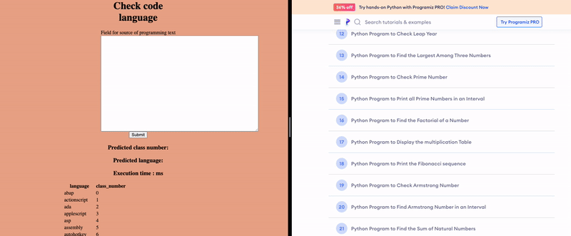

# code_language_detection_web

### Web application with code language detection model

Training and evaluating model [here](https://github.com/dmdgik/code_language_detection)

### Screencast of application work:

The screencast was recorded on an AWS EC2 instance.



### Prerequires

docker, docker-compose

### command for run application:

```console
docker-compose up --build -d
```

### Write to me if you want me to send you a link with the running application on AWS
